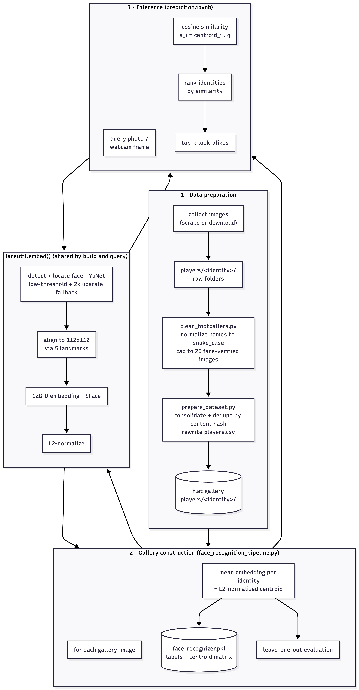

# Facial Similarity Search

Point it at any photo (selfie, crowd shot, full-body frame) and it tells you which of
235 cricketers, footballers, and actors you look like, and how strongly. Under the hood it
is a metric-learning retrieval engine, not a classifier: YuNet (`FaceDetectorYN`)
detects and 5-point-aligns the face, SFace (`FaceRecognizerSF`) projects the aligned crop
into a 128-D L2-normalised embedding, and a query is ranked against per-identity centroids
by cosine similarity in a single matrix multiply. Zero gradient descent, zero fine-tuning:
identities are the *data*, not the weights, so extending the gallery is a re-index, not a
retrain. Leave-one-out cross-validation lands **top-1 0.941 / top-5 0.960** across ~4,110
images (vs. a 0.004 random baseline), and the whole thing ships as a self-contained
Streamlit app with sub-second CPU-only inference and no photo ever touching disk.

## Method



The pipeline has three stages, all provided by OpenCV's `objdetect` module:

1. **Detection and alignment**: `FaceDetectorYN` (YuNet) locates the most prominent face
   in an image and returns its bounding box and five landmarks. The face is then aligned to
   a canonical 112x112 crop using those landmarks. Because detection runs on the full image,
   the face is recovered even from full-body photographs.
2. **Embedding**: `FaceRecognizerSF` (SFace) maps the aligned crop to a 128-dimensional
   embedding, which is L2-normalised so that inner products are cosine similarities.
3. **Matching**: each identity is represented by the mean of its gallery embeddings
   (re-normalised to unit length). A query embedding `q` is scored against every identity
   centroid `c_i` by cosine similarity `s_i = c_i · q`, and the identities are ranked by `s`.

Detection recall on difficult images is improved by a fallback: if no face is found at the
default score threshold, detection is retried at a lower threshold and then on a 2x upscale
of the image.

## Requirements

- Python 3.12
- `requirements.txt`: the app's runtime deps (`streamlit`, `opencv-python-headless`,
  `numpy`, `pillow`); this is what Streamlit Cloud installs.
- `scripts/requirements.txt`: extra deps for the offline pipeline (`matplotlib`,
  the scraper's `selenium`/`requests`, etc.).

```
python3.12 -m venv myenv
./myenv/bin/pip install -r requirements.txt              # to run the app
./myenv/bin/pip install -r scripts/requirements.txt      # to rebuild the gallery
```

The YuNet and SFace ONNX weights are downloaded automatically from the OpenCV Zoo
(into `face_models/` for the scripts, `assets/` for the app) on first use.

## Data layout

The gallery is a flat directory, one folder per identity. There is no train/validation
split; the gallery is the model.

```
celebrity/<identity>/<content_hash>.<ext>   reference images
celebrity/celebrities.csv                   index, image, identity
```

Image files are named by a truncated MD5 of their contents, which makes de-duplication and
idempotent re-imports trivial.

## Usage

All offline scripts live in `scripts/` and are run from the project root:

```
# 1. Optional: normalise identity names to snake_case and cap oversized folders to
#    20 face-verified images each (used after importing large scraped folders).
./myenv/bin/python scripts/balance_gallery.py

# 2. Consolidate any prior layout into the flat gallery, de-duplicate by content hash,
#    and rewrite celebrities.csv.
./myenv/bin/python scripts/prepare_dataset.py

# 3. Build the gallery embeddings, write face_recognizer.pkl, and report accuracy.
./myenv/bin/python scripts/face_recognition_pipeline.py

# 4. Bundle the deployable assets (models, centroids, thumbnails) into assets/.
./myenv/bin/python scripts/build_assets.py

# 5. Query. In scripts/prediction.ipynb:
#       lookalike("path/to/photo.jpg")
```

To extend the gallery, place images under `celebrity/<identity>/` and re-run steps 1-4.

## App

`app.py` is a self-contained Streamlit app: upload or capture a face and see the top-5
look-alikes. It reads only `assets/` (gallery centroids + one thumbnail per identity);
the two ONNX face models are downloaded on first run, so they are not committed.

```
# run locally
./myenv/bin/streamlit run app.py          # http://localhost:8501
```

### Deploy on Streamlit Community Cloud

Push the repo to GitHub and create a new app pointing at `app.py` on the default branch.
Streamlit Cloud installs `requirements.txt` and the apt package in `packages.txt`
(`libglib2.0-0`, needed by headless OpenCV) automatically. Uploaded photos are processed
in memory and never written to disk.

## Evaluation

With no held-out split, quality is estimated by leave-one-out cross-validation: each gallery
image is matched while its own embedding is excluded from its identity's centroid, so an
image is never scored against a copy of itself.

Current gallery: 235 identities (cricketers, footballers, actors), ~4,110 images
(capped at 20 per identity).

| Metric                  | Value |
| ----------------------- | ----- |
| Leave-one-out top-1     | 0.941 |
| Leave-one-out top-5     | 0.960 |
| Random baseline (top-1) | 0.004 |

## Files

| File                                   | Purpose                                                                                                                |
| -------------------------------------- | ---------------------------------------------------------------------------------------------------------------------- |
| `app.py`                               | Streamlit look-alike app (upload / camera). Entry point for deployment.                                                |
| `recognizer.py`                        | Self-contained inference (detection + embedding + matching) used by the app; reads only `assets/`.                     |
| `assets/`                              | Deployable bundle: `face_recognizer.pkl` and one thumbnail per identity (ONNX models fetched at runtime).              |
| `scripts/faceutil.py`                  | Detection, alignment, and embedding. Imported by both gallery construction and inference so the two never diverge.     |
| `scripts/prepare_dataset.py`           | Consolidates any existing layout into the flat gallery, de-duplicates by content hash, and rewrites `celebrities.csv`. |
| `scripts/balance_gallery.py`           | Normalises folder names to snake_case and caps oversized folders to N face-verified images.                            |
| `scripts/face_recognition_pipeline.py` | Builds the identity centroids, writes `face_recognizer.pkl`, and prints leave-one-out accuracy.                        |
| `scripts/build_assets.py`              | Copies models + centroids and renders thumbnails into `assets/` for the app.                                           |
| `scripts/extract_faces.py`             | Writes aligned face crops to `celebrity_faces/` for visual inspection.                                                 |
| `scripts/prediction.ipynb`             | Interactive querying from an image file or webcam (run with the project root as the working directory).                |
| `scripts/data_scraping.py`             | Standalone Google Images scraper for collecting additional reference photos.                                           |

## Limitations

- Embeddings come from a model pretrained on general face data; identities absent from the
  gallery cannot be recognised, and similarity scores are relative, not calibrated
  probabilities.
- Accuracy is bounded by gallery size and image quality per identity; several identities have
  fewer than ten reference images.
- Detection can fail on heavily occluded, low-resolution, or non-frontal faces; such images
  are skipped during gallery construction and reported.
